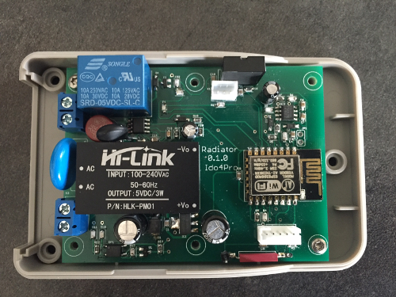
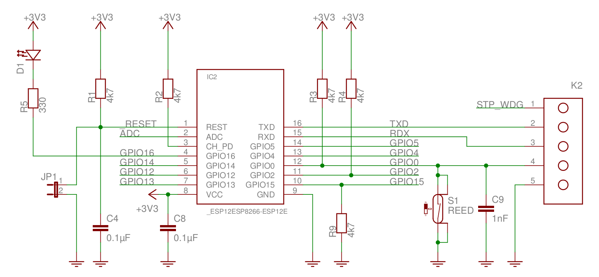
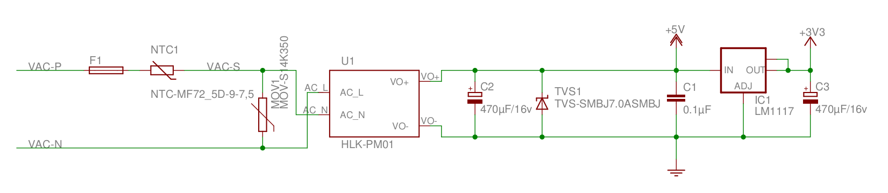
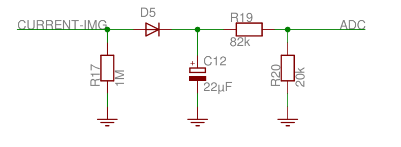

# Tineco

 [Version française]

## Hardware

Tineco is a WIFI thermostat to control your boiler system or one electrical heater.

Tineco is based on the esp8266 module. 

This wifi module has a great SDK to allow easy firmware modification with an OTA process.

Tineco has an internal tem/humidity sensor, a external one-wire bus to connect a DS1820 sensor, a 10 A relay with current sensor.

Tineco has an integrated convertor (220v) to power the electronic boad.

A hardware watchdog detect failure of the firmware and restart automaticaly the esp8266 module.

## Software

The source code is written in C++ and based on the sming framework : [sming](https://github.com/SmingHub) et le language C++. 

The source code will published soon.

## Author

Stéphane GUILLY - stephane.guilly@ido4pro.com
Thierry COUSIN - thierry.cousin@ido4pro.com

Contact us if you are interresting to buy a product

 
 
 

